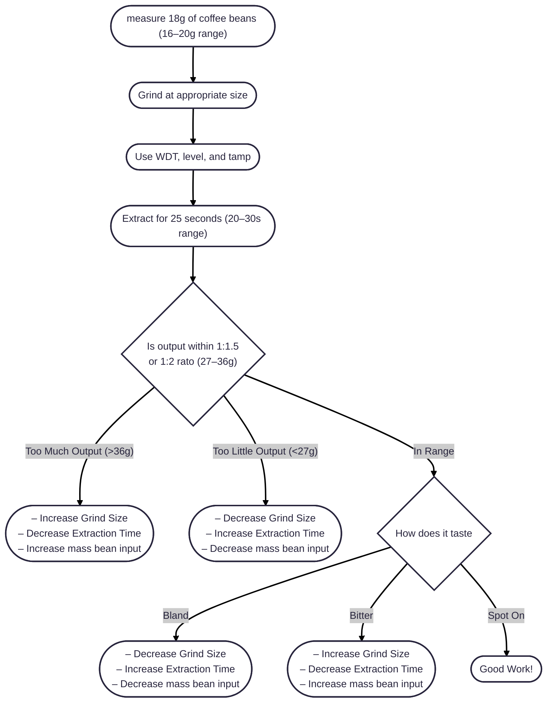

## Espresso Making Guide

Espresso extracts first the tasty acids, then the sugars, then the bitter flavors.
Goal is to extract as much of the first two and as little of the latter.
Espresso has a very tightly defined spec by the [SCA](https://sca.coffee/sca-news/25-magazine/issue-3/defining-ever-changing-espresso-25-magazine-issue-3)
To make a good beverage in this spec, we can adjust the grind size, the extraction time, and the input bean size
We should always adjust variables one at a time in the following order:
- Adjust grind size first to get an extraction rate that results in the appropriate amount (27-36g) in the appropriate time (20-30s)
- Adjust extraction time to adjust output amount or flavoring
- Only adjust the bean input amount once the other two variables have been exhausted

