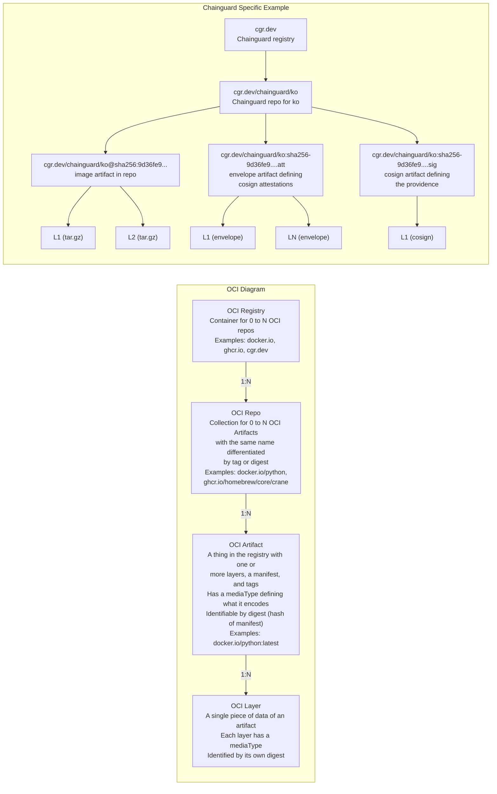

## OCI Diagram

#### As Ascii Art
```ascii
┌─────────────────────────────────────────────────────────────────────────────────────────────┐
│                                      OCI Diagram                                            │
├─────────────────────────────────────────────────────────────────────────────────────────────┤
│                                                                                             │
│  ┌─────────────────┐       ┌─────────────────┐       ┌─────────────────┐       ┌─────────┐ │
│  │  OCI Registry   │ 1:N   │    OCI Repo     │ 1:N   │  OCI Artifact   │ 1:N   │   OCI   │ │
│  │                 │──────>│                 │──────>│                 │──────>│  Layer  │ │
│  │ - Container for │       │ - Collection of │       │ - Has layers,   │       │         │ │
│  │   0 to N repos  │       │   0 to N        │       │   manifest,     │       │ - Single│ │
│  │ - Examples:     │       │   artifacts     │       │   and tags      │       │   piece │ │
│  │   docker.io,    │       │ - Identified    │       │ - Has mediaType │       │   of    │ │
│  │   ghcr.io,      │       │   by URI        │       │ - Identified by │       │   data  │ │
│  │   cgr.dev       │       │ - Examples:     │       │   digest        │       │ - Has   │ │
│  │                 │       │   docker.io/    │       │ - Examples:     │       │   media │ │
│  │                 │       │   python,       │       │   python:latest │       │   Type  │ │
│  │                 │       │   ghcr.io/      │       │                 │       │ - Has   │ │
│  │                 │       │   homebrew/     │       │                 │       │   digest│ │
│  │                 │       │   core/crane    │       │                 │       │         │ │
│  └─────────────────┘       └─────────────────┘       └─────────────────┘       └─────────┘ │
│                                                                                             │
└─────────────────────────────────────────────────────────────────────────────────────────────┘

┌─────────────────────────────────────────────────────────────────────────────────────────────┐
│                             Chainguard Specific Example                                     │
├─────────────────────────────────────────────────────────────────────────────────────────────┤
│                                                                                             │
│  ┌──────────────┐         ┌─────────────────────────┐                                      │
│  │   cgr.dev    │────────>│  cgr.dev/chainguard/ko  │                                      │
│  │              │         │  (Chainguard repo)      │                                      │
│  │ Chainguard   │         └──────────┬──────────────┘                                      │
│  │  registry    │                    │                                                     │
│  └──────────────┘                    │                                                     │
│                                      ├──────────────────────┬────────────────────────┐     │
│                                      │                      │                        │     │
│                                      ▼                      ▼                        ▼     │
│             ┌────────────────────────────────┐  ┌──────────────────────┐  ┌───────────────┐│
│             │ cgr.dev/chainguard/ko@         │  │ cgr.dev/chainguard/  │  │ cgr.dev/...   ││
│             │ sha256:9d36fe9...              │  │ ko:sha256-9d36fe9... │  │ :sha256-...   ││
│             │ (image artifact)               │  │ .att (attestations)  │  │ .sig (cosign) ││
│             └───────┬────────┬───────────────┘  └──────┬───────┬───────┘  └───────┬───────┘│
│                     │        │                         │       │                  │        │
│                     ▼        ▼                         ▼       ▼                  ▼        │
│              ┌─────────┐ ┌─────────┐           ┌─────────┐ ┌─────────┐      ┌─────────┐   │
│              │L1       │ │L2       │           │L1       │ │LN       │      │L1       │   │
│              │(tar.gz) │ │(tar.gz) │           │(envelope)│(envelope)│      │(cosign) │   │
│              └─────────┘ └─────────┘           └─────────┘ └─────────┘      └─────────┘   │
│                                                                                             │
└─────────────────────────────────────────────────────────────────────────────────────────────┘
```

#### As Mermaid Diagram

